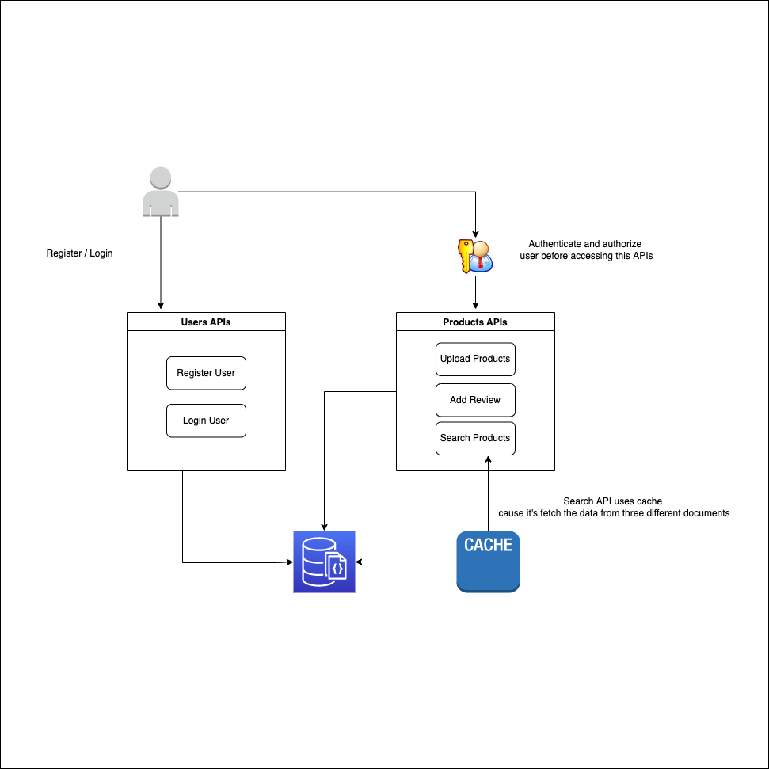

## GROCERY SHOP BACKEND


### Solution
 <br />

The system is exposing RESTful API developed by Flask, 
and using MongoDB as the database, Mongo enable fast insertion and retrieval of the data which makes it suits this kind of E-Commerce API.<br /> 
- Created unique index on the product `barcode` to ensure uniqueness when adding products. <br />
- Created text index on the product `name` and `brand` to enable fast queries when performing the search. <br />
- JWT is used for authentication and authorization. <br />
  - Also created `role_required` decorator to check if the user has the right role to access the resource. <br />
- Marshmallow is used to validate the input data. Created three schemas for users, products, and reviews. <br />
- Used flask blueprints to separate the different parts of the API. <br />
  - The user blueprint is the first API blueprint, which is used to handle the registration and provide the access token to the client. <br />
  - The product blueprint is handling insertion, reviewing and, search products. <br />
  - Search product API uses caching to reduce the number of database queries because we're performing an aggregation between three different documents `[products, reviews, users]`.<br />
  - Search product API can also return the full list of products when there is no search query provided, and that leads to return invalid result with there is no query provided, and that leads to enabling the cache to use query params when creating the cache key. <br />
  - Search product API also uses pagination to return the list of products in chunks. <br />
  - Upload products API reads the uploaded file to an in-memory file and uses bulk insert to insert multiple products at once which improves the performance and reduces database io operation. <br />
- Application configuration is stored in environment variables to securely and easily update them (used `dotenv` package that follows the 12-factor principles). <br />

### Performance Considerations
- Reading the whole uploaded file into memory is not a good idea when the file is large. Consider reading line by line to form the CSV file content.<br />
- `role_required` decorator is checking the user role after fetching the user record from the DB, although fetching might be fast, consider adding the role in JWT claims data when the user gets authenticated. <br />

### Installation
- Clone the repository:

```bash 
git clone https://github.com/galalen/grocery-shop.git
```

- Create and active the virtual environment:

```bash 
virtualenv venv
source venv/bin/activate
```

- Install the dependencies:

```bash 
pip install -r requirements.txt
```

- Run MongoDB docker image:

```bash 
docker run -d -p 27017:27017 --name mongo mongo
```

- Create .env file (the keys provided in .env.example):

```bash 
cp .env.example .env
# override the default values with your own
FLASK_ENV=development
DEBUG=True
FLASK_PORT=8000
SECRET_KEY=secret
MONGO_URI=mongodb://localhost:27017/grocery
```

- Run the server:

```bash 
python app.py
```
